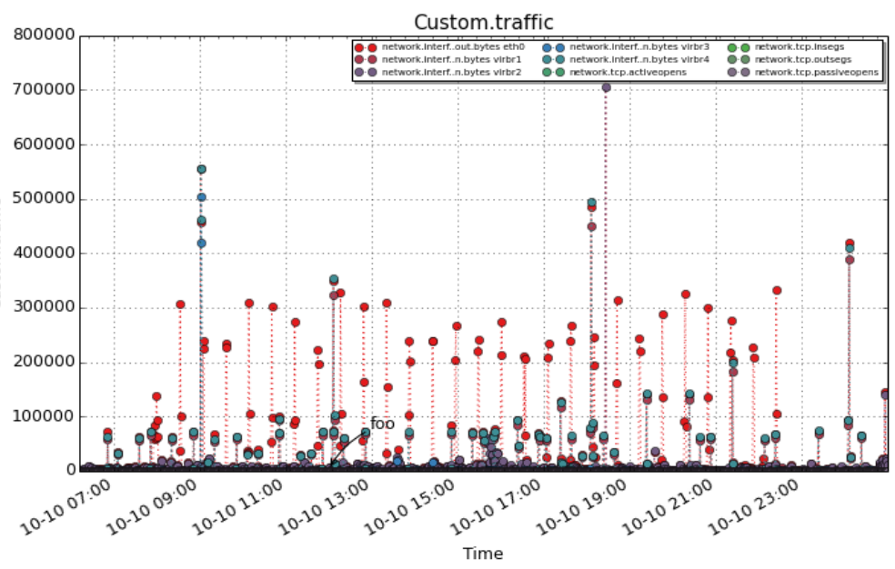

This document gives an introduction to `pcp2pdf`

What is pcp2pdf for?
====================

The main goal of pcp2pdf is to create a visually pleasing report of a
[Performance Co-Pilot](http://pcp.io) archive file. PCP archive files
contain a bunch of metrics of a system and are usually created by the
pmlogger service, which is part of `Performance Co-Pilot`.

Prerequisites
=============

pcp2pdf is a python program and makes use of these 3rd party modules:

-   [matplotlib](http://matplotlib.org/users/installing.html)
-   [reportlab](http://www.reportlab.com/opensource/)

Installation
============

If you're using Fedora, you can use the packages found [here](http://acksyn.org/files/rpms/pcp2pdf/).
Otherwise just use the following:

    ./setup.py install
    pcp2pdf --help

Usage examples
==============

For example if we have a PCP archive and we would like to understand how
the performance metrics behaved during the time interval from "Fri Oct
10 22:10" to "Sat Oct 11 01:00", and we would also like to see the
following:

-   How the eth0 TX patch behaved in correlation to the TCP statistics
-   How the eth0 RX and TX behaved
-   A label on the graph at 23:00 on Friday when users told us things
    are "slow"
-   Lower DPI quality (75)

For example:

    pcp2pdf -S "Fri Oct 10 22:10:12.362 2014" -T "Sat Oct 11 01:00:00.00 2014" --dpi 75 \
        -t "14 minute" -c "traffic:network.interface.out.bytes:eth0,network.tcp..*:.*" \
        -c "in_out:network.interface.out.bytes:eth0,network.interface.in.bytes:eth0" \
        -l 'slow:2014-10-10 23:00:00' -a pcparchivedir/20141010

Here is a sample pdf [report](http://acksyn.org/software/pcp2pdf/output.pdf)

Caveats
=======

Except when running with Python versions (\<= 2.6), pcp2pdf will run in
SMP mode and use all of the available CPUs to generate the graphs. It
won't do that on older Python stacks, due to a number of issues that
were encountered on such systems (it will just be a tad slower).

By default pcp2pdf uses a DPI value of 200. While this gives
high-quality looking graphs it takes quite a bit of memory and CPU time.
It is possible to reduce both RAM and CPU usage by setting a smaller DPI
value in `pcp2pdf.conf` or with the `--dpi` switch.

Bugs
====

Feel free to report any issues
[here](https://github.com/performancecopilot/pcp2pdf/issues)
